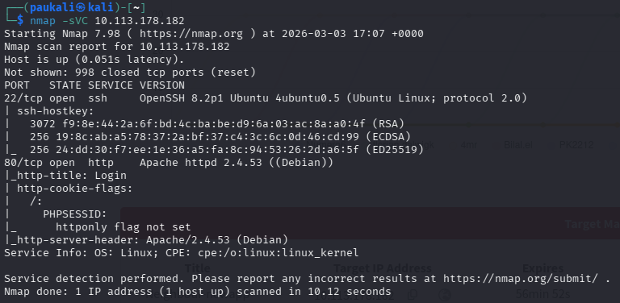
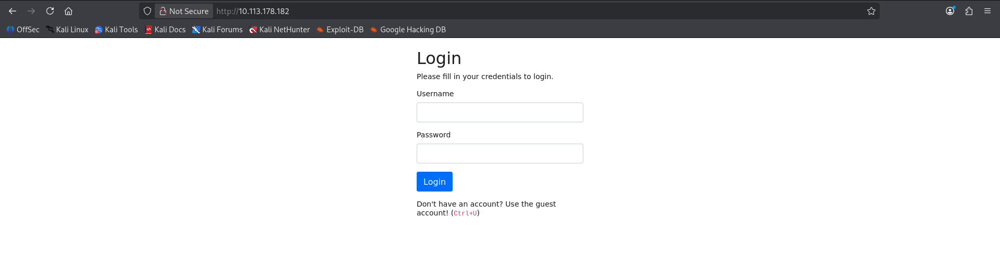
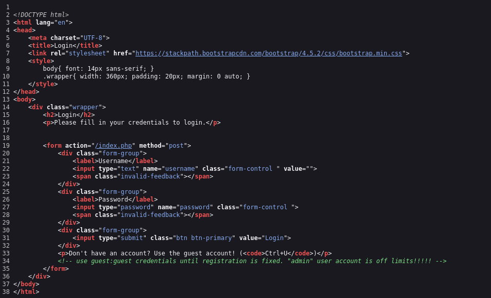
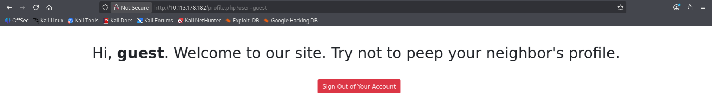
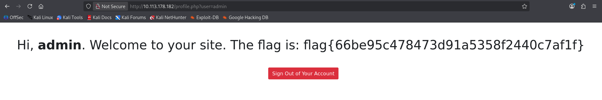

# Neighbour

Platform: TryHackMe  
Difficulty: Easy  
Category: Web / IDOR  

---

## 1. Initial Reconnaissance

### 1.1 Port Scan

```bash
nmap -sVC <TARGET_IP>
```



### Key Findings

- **Port 22** → SSH (OpenSSH, Ubuntu)
- **Port 80** → HTTP (Apache, Debian default page)

Port 80 exposes a web service.

---

## 2. Web Analysis

Navigating to:

```
http://<TARGET_IP>
```



The web shows a simple login form requiring username and password.

---

## 3. Source Code Inspection

Reviewed page source for any clues.



We can see that they provide the guest:guest credentials so they were tested.

## 4. Authentication Testing

Tested given credentials:

```
guest : guest
```

Authentication successful.



After login, the URL contains:

```
?user=guest
```

The application appears to rely on a URL parameter to determine which user profile is displayed.

This suggests the application directly trusts the `user` value from the request.

## 5. Exploitation > Insecure Direct Object Reference (IDOR)

The application uses a query parameter:

```
?user=guest
```

Since the parameter determines which profile is displayed, modifying it may grant access to other users' data.

Modified the URL to:

```
?user=admin
```

Access granted to the admin profile.



The flag was exposed.

---

## 6. Vulnerability Analysis

### Root Cause

The application does not enforce proper authorization checks server-side.

It relies only on a user-controlled parameter (`user`) to determine which profile to display.

Ergo an **Insecure Direct Object Reference (IDOR)** vulnerability.

### Why It Works

- The server does not validate whether the authenticated user is authorized to access the requested profile.
- User identity is determined by a modifiable query parameter.

---

## 7. Mitigation

- Enforce server-side authorization checks.
- Do not rely on user-supplied parameters to determine access control.
- Use session-based identity validation.

---

## 8. Key Takeaways

- Always inspect URL parameters after authentication.
- Authorization flaws are as critical as authentication flaws.
- IDOR vulnerabilities arise from missing or improperly enforced access control validation.