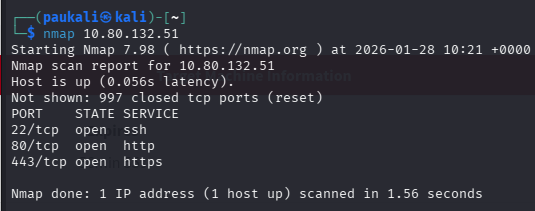
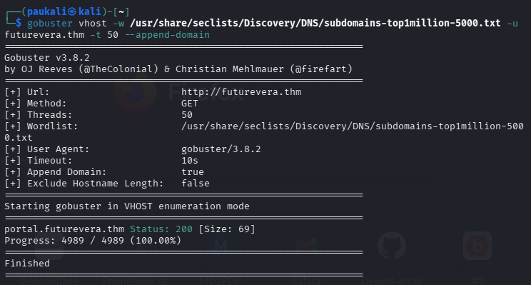
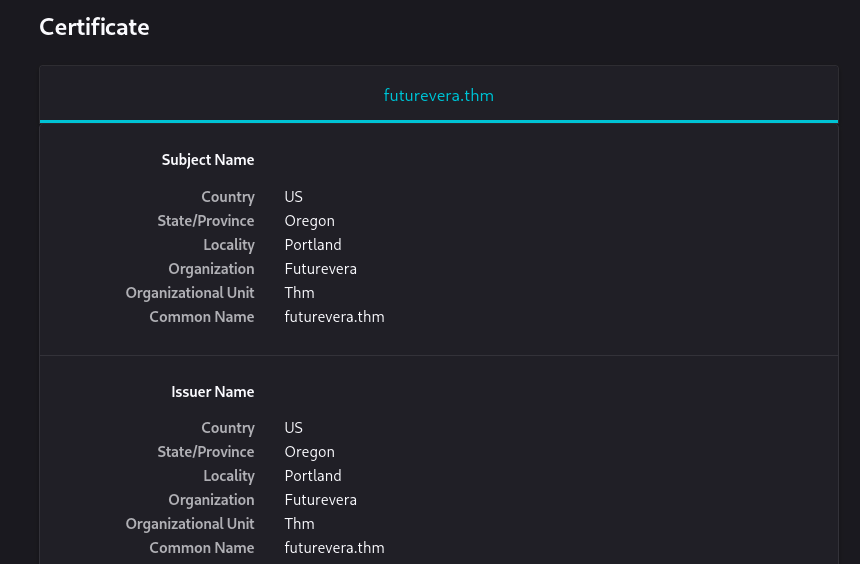
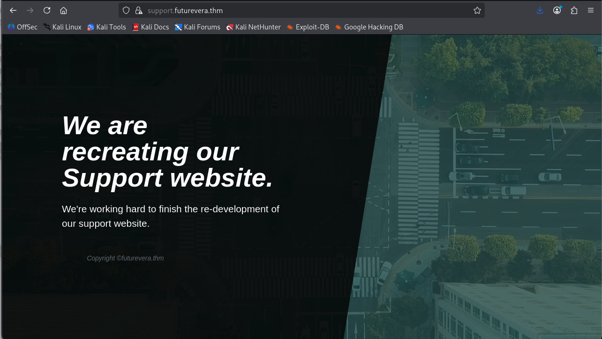
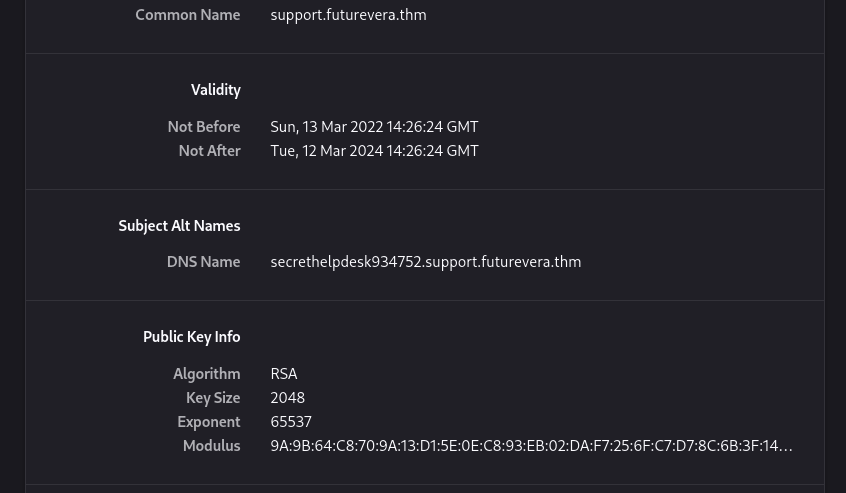
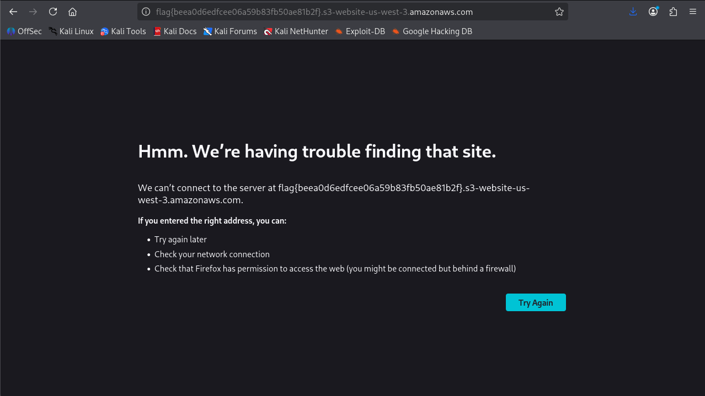

# Takeover

Platform: TryHackMe  
Difficulty: Easy  
Category: Web / Subdomain Enumeration  

---

## 1. Initial Reconnaissance

### 1.1 Port Scan

```bash
nmap <TARGET_IP>
```



### Key Findings

- **Port 22** → SSH
- **Port 80** → HTTP
- **Port 443** → HTTPS

The attack surface is entirely web-based.

---

## 2. Host Resolution

Accessing `https://futurevera.thm` initially failed due to missing DNS resolution.

Added the target IP to `/etc/hosts`:

```
<TARGET_IP> futurevera.thm
```


After updating the hosts file, the website became accessible.


---

## 3. Virtual Host Enumeration

Since both HTTP and HTTPS are exposed, virtual host enumeration was performed.

```bash
gobuster vhost \
-w /usr/share/seclists/Discovery/DNS/subdomains-top1million-5000.txt \
-u http://futurevera.thm \
--append-domain -t 50
```



### Discovered Subdomain

```
portal.futurevera.thm
```

Added to `/etc/hosts`:

```
<TARGET_IP> portal.futurevera.thm
```

The portal interface mirrored the main site, suggesting additional hidden subdomains.


---

## 4. Certificate Inspection

Given that HTTPS is enabled, the TLS certificate was inspected for Subject Alternative Names (SANs).



This revealed another subdomain:

```
support.futurevera.thm
```

Added to `/etc/hosts` 

The subdomain was accessible.



---

## 5. Further Certificate Analysis

Inspecting the TLS certificate on the support subdomain revealed an additional SAN entry:



```
secrethelpdesk934752.support.futurevera.thm
```

This indicates an internal or hidden support endpoint.

Added to `/etc/hosts`:

```
<TARGET_IP> secrethelpdesk934752.support.futurevera.thm
```

---

## 6. Exploitation

Accessing:

```
http://secrethelpdesk934752.support.futurevera.thm
```



revealed the flag.

---

## 7. Vulnerability Analysis

### Root Cause

The organization exposed sensitive subdomains through:

- Predictable subdomain naming
- TLS certificate Subject Alternative Name (SAN) leakage

### Why It Works

- Certificates publicly disclose alternative domain names.
- Internal subdomains were accessible externally.
- No access control or network segmentation restricted hidden endpoints.

---

## 8. Mitigation

- Avoid exposing internal subdomains in public TLS certificates.
- Implement proper network segmentation.
- Restrict access to internal services via firewall or VPN.
- Regularly audit externally reachable subdomains.

---

## 9. Key Takeaways

- Always inspect TLS certificates during web assessments.
- Subdomain enumeration includes vhost brute-forcing and certificate analysis.
- Misconfigured infrastructure often exposes unintended attack surfaces.
- Hidden endpoints are frequently discoverable through passive reconnaissance.
