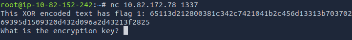
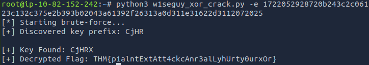
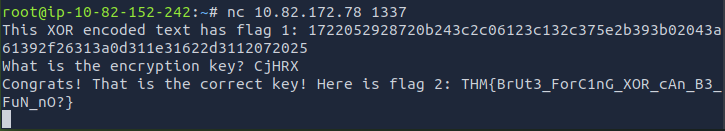

# W1seGuy

Platform: TryHackMe  
Difficulty: Easy  
Category: Cryptography / Repeating-Key XOR  

---

## 1. Source Code Analysis

The provided Python server:

1. Generates a random **5-character alphanumeric key**
2. XORs a hardcoded string with that key
3. Sends the hex-encoded ciphertext to the client
4. Asks the user to provide the encryption key
5. If correct → returns the real flag

Relevant logic:

```python
res = ''.join(random.choices(string.ascii_letters + string.digits, k=5))
key = str(res)

for i in range(0,len(flag)):
    xored += chr(ord(flag[i]) ^ ord(key[i % len(key)]))
```

### Key Observations

- Key length = **5**
- Key charset = `ascii_letters + digits`
- XOR is repeating (`i % len(key)`)
- Encrypted message format starts with `THM{`

---

## 2. Connecting to the Service

```bash
nc <TARGET_IP> 1337
```

Server response:



We must recover the 5-character key.

---

## 3. Attack Strategy

Since we know:

- The key length is 5
- The flag format starts with `THM{`
- XOR is reversible

We can recover part of the key using a **known plaintext attack**.

XOR property:

```
cipher = plaintext ^ key
key = cipher ^ plaintext
```

---

## 4. Exploit Script

The following script by the amazing **AdityaBhatt3010** performs:

1. Recover first 4 key characters using `THM{`
2. Brute-force the remaining key character
3. Validate by checking decrypted output structure

### Script

```python
import binascii
import string
import itertools
from concurrent.futures import ThreadPoolExecutor, as_completed
import argparse

def xor_bytes(data, key):
    return bytes([b ^ ord(key[i % len(key)]) for i, b in enumerate(data)])

def find_initial_key(encrypted_hex, known_plaintext):
    encrypted_bytes = binascii.unhexlify(encrypted_hex)
    return ''.join([chr(b ^ ord(known_plaintext[i])) for i, b in enumerate(encrypted_bytes[:len(known_plaintext)])])

def brute_force_key(encrypted_hex, known_prefix="THM{", known_suffix="}"):
    encrypted_bytes = binascii.unhexlify(encrypted_hex)
    key_prefix = find_initial_key(encrypted_hex, known_prefix)
    print(f"[+] Discovered key prefix: {key_prefix}")

    charset = string.ascii_letters + string.digits
    remaining_length = 5 - len(key_prefix)

    def try_key(key):
        full_key = key_prefix + key
        decrypted = xor_bytes(encrypted_bytes, full_key).decode(errors='ignore')
        if decrypted.startswith(known_prefix) and decrypted.endswith(known_suffix):
            return full_key, decrypted
        return None

    found = []
    with ThreadPoolExecutor(max_workers=10) as executor:
        tasks = {
            executor.submit(try_key, ''.join(candidate)): ''.join(candidate)
            for candidate in itertools.product(charset, repeat=remaining_length)
        }
        for future in as_completed(tasks):
            result = future.result()
            if result:
                found.append(result)
                break

    return found

if __name__ == "__main__":
    parser = argparse.ArgumentParser(description="XOR Key Brute Forcer for W1seGuy Challenge")
    parser.add_argument("-e", "--encrypted", required=True, help="Hex encoded XOR ciphertext")
    args = parser.parse_args()

    print("[*] Starting brute-force...")
    results = brute_force_key(args.encrypted)

    if results:
        for key, flag in results:
            print(f"\n[+] Key Found: {key}")
            print(f"[+] Decrypted Flag: {flag}")
    else:
        print("[-] No matching flag found.")
```

---

## 5. Running the Exploit

Save as:

```
w1seguy_xor_crack.py
```

Run:

```bash
python3 w1seguy_xor_crack.py -e <HEX_STRING>
```

Output:



---

## 6. Retrieve Flag 2

Reconnect to the server:

```bash
nc <TARGET_IP> 1337
```

Enter the recovered key:



---

## 7. Why This Works

- First 4 key bytes are recovered directly from known prefix `THM{`
- Only 1 key byte remains unknown
- Keyspace = 62 possible characters
- Brute-forcing 62 possibilities is trivial
- Validation confirms correct key

---

## 8. Vulnerability Analysis

### Root Cause

- Repeating-key XOR
- Short key length (5)
- Predictable plaintext structure
- No cryptographic integrity checks

### Impact

An attacker can recover the key almost instantly and bypass authentication to obtain the real flag.

---

## 9. Key Takeaways

- Repeating-key XOR is insecure
- Small key sizes are easily brute-forced
- Known plaintext dramatically reduces attack complexity
- Custom cryptography is dangerous
